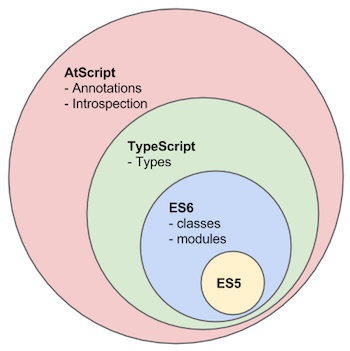

# 什么是TypeScript

### 什么是Typescript?

     TypeScript 是一种由微软开发和维护的免费开源编程语言。它是一个强类型的 JavaScript 超集，可编译为纯 JavaScript。它是一种用于应用级 JavaScript 开发的语言。对于熟悉 c\#、Java 和所有强类型语言的开发人员来说，TypeScript 非常容易学习和使用。

     TypeScript 可以在任何浏览器、主机和操作系统上执行。TypeScript 不是直接在浏览器上运行的。它需要一个编译器来编译和生成 JavaScript 文件。TypeScript 是带有一些附加特性的 ES6 JavaScript 版本。

### 

### 为什么选择 Typecript

#### 优点：

* Early Detection of Errors  及早发现错误
* Improves Code Readability 提高代码可读性
* Promotes Dependable Refactoring 促进可靠的重构
* Improved IDE Support 改进的IDE支持
* Easy Code Analysis  简易代码分析

#### 缺点：

任何事物都是有两面性的，我认为 TypeScript 的弊端在于：

* 有一定的学习成本，需要理解接口（Interfaces）、泛型（Generics）、类（Classes）、枚举类型（Enums）等前端工程师可能不是很熟悉的概念
* 短期可能会增加一些开发成本，毕竟要多写一些类型的定义，不过对于一个需要长期维护的项目，TypeScript 能够减少其维护成本
* 集成到构建流程需要一些工作量
* 可能和一些库结合的不是很完美

大家可以根据自己团队和项目的情况判断是否需要使用 TypeScript。

